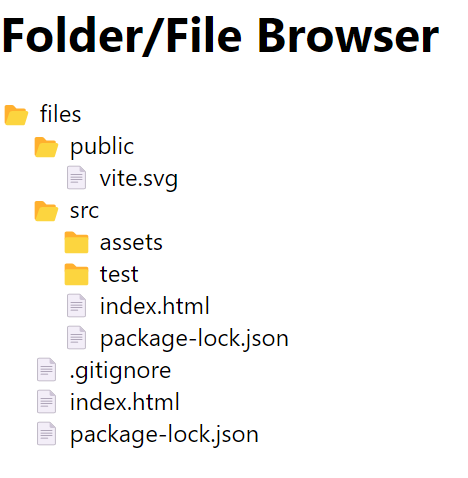

# Folder/File Browser

## Steps to Run

1. Clone the repository.
2. Navigate to the project directory.
3. Run `npm install` to install dependencies.
4. Run `npm start` to start the application.

## Screenshot

